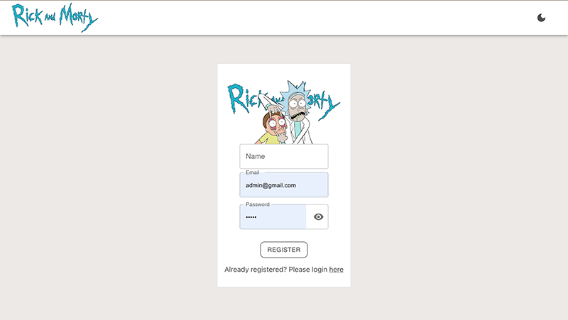
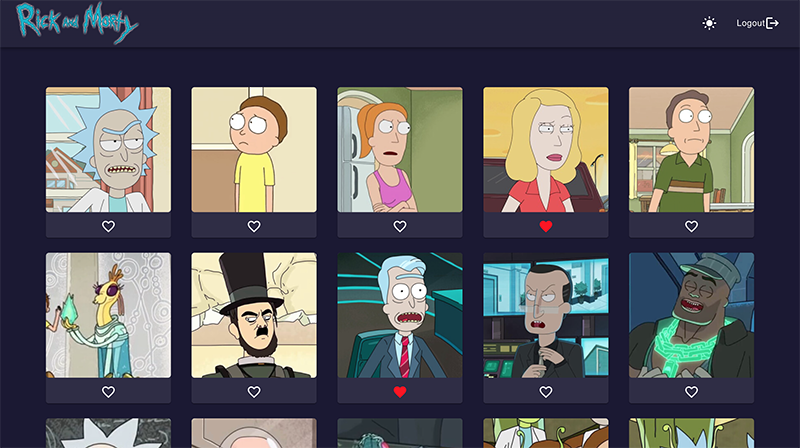
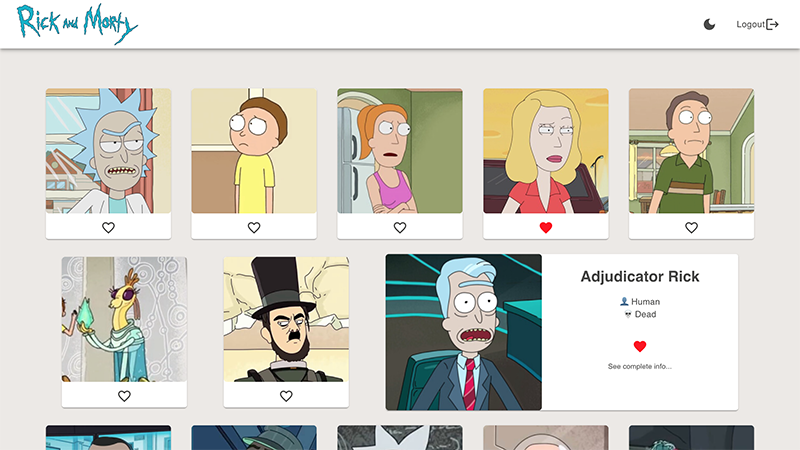

  <h1> RICK and MORTY APP </h1>

[🔗 Rick and Morty APP](https://vivitt.github.io/rick_morty_app/)

  
An app to navigate trough the characters from this TV show, get the basic info and select your favorite ones.

  
This project is the Talent Squad's frontend challenge driven by Barcelona Digital Talent.

  

## API/Component

This app get the data from the [The Rick and Morty API](https://rickandmortyapi.com/)

Uses [The Movie App](https://github.com/vivitt/Movie_APP) as API for user registration and login

#### Page structure

##### Home '/'

- register new user
- login registered user

##### characters '/chars'

- get the characters from https://rickandmortyapi.com/api/character/?page=1
- paginate the results
- show a small view of each character
- show a big view of clicked character with a link to the Details page

##### Details '/chars/:id'

- get the one character info from https://rickandmortyapi.com/api/character/:id
- show character's details

##### 404 Not found '/anything-else'

- render a 404 page to mismatched urls

## Installation

npm i

npm start

## Stack

This app was made with **React** and **MUI**

**Axios**

**SASS**
